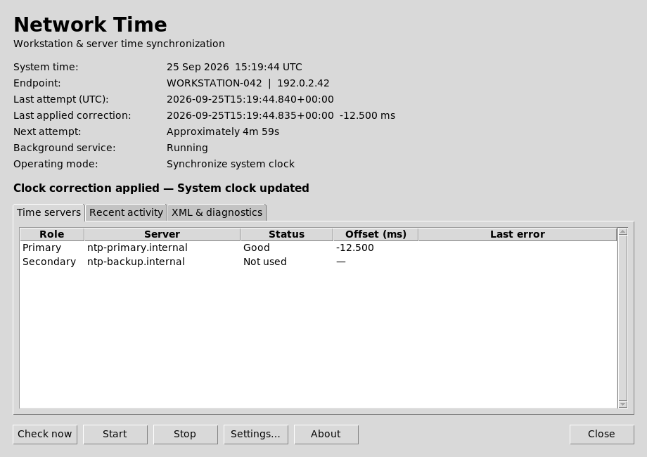

# Desktop window

The optional **Network Time** window follows the simple status/settings layout
in the supplied reference. The background service continues when the window closes.

- Current local time, host/IP, last attempt, last recorded applied correction,
  approximate next attempt, service state, and monitor/synchronize mode.
- Primary/fallback server table with latest attempt result, measured offset,
  and error text. A source not queried this cycle is shown as **Not used**.
- Recent activity from the current XML history file (latest 30 events).
- XML locations, rotation, retention, and operational-log instructions.
- Settings for both servers, interval, timeout, correction threshold, clock
  adjustment, log directory, rotation, retention cap, and host override.
- Start, Stop, and Check now controls for the installed service.

**Check now restarts the service** to trigger its initial cycle, using its configured
clock-adjustment policy. It asks before doing so. It does not start a competing
monitor process. Saving settings validates them before replacement; the user can
then restart the service to apply the change. Invalid edits leave the original
configuration untouched.

The window reads real status and history XML. It does not invent healthy results:
missing/malformed output is unavailable, old output is marked stale, skipped
correction is distinguished from successful adjustment, and service state is
queried separately. Next-attempt timing is an estimate from the latest report,
not a service scheduler guarantee. Last correction is limited to the current
retained history file (today's file for daily rotation). NTS and time-server
hosting are explicitly shown as unavailable/out of scope.

## Preview



The preview uses example data rendered on Linux; native Windows styling differs.

## Launch

From source on a desktop with Python/Tk installed:

```sh
python3 gui.py --config /path/to/config.json
```

Windows installer builds now include a **NTP Client Monitor** Start-menu shortcut
and `gui\ntp-monitor-gui.exe`. It requests administrator access so it can read and
save protected settings and control the service. The executable bundles Python/Tk.

Linux installer builds now include an application-menu entry and
`/usr/bin/ntp-monitor-gui`. The launcher requests authentication with polkit and
opens the bundled desktop executable. A desktop display and X11/XWayland access
are required; headless servers continue using the service and CLI. Wayland display
access and polkit dialogs need validation on your chosen desktop environment.

Service controls are enabled only when viewing the installed service config:
`%ProgramData%\NTPClientMonitor\config.json` or `/etc/ntp-monitor/config.json`.
A custom/source config can be viewed/edited, but cannot control an unrelated service.

## Verification

`tests/test_desktop.py` covers atomic validated settings saves, stale status,
malformed XML, last-applied correction selection, and fixed service commands.
`scripts/smoke_desktop.py` renders a deterministic example, opens Settings, and
checks that closing the window does not invoke a service command. Its screenshot
uses example data, not a live endpoint.

The installer build recipes include the GUI. Windows native appearance, UAC,
service controls, and clean-machine installation still need a Windows runner.
